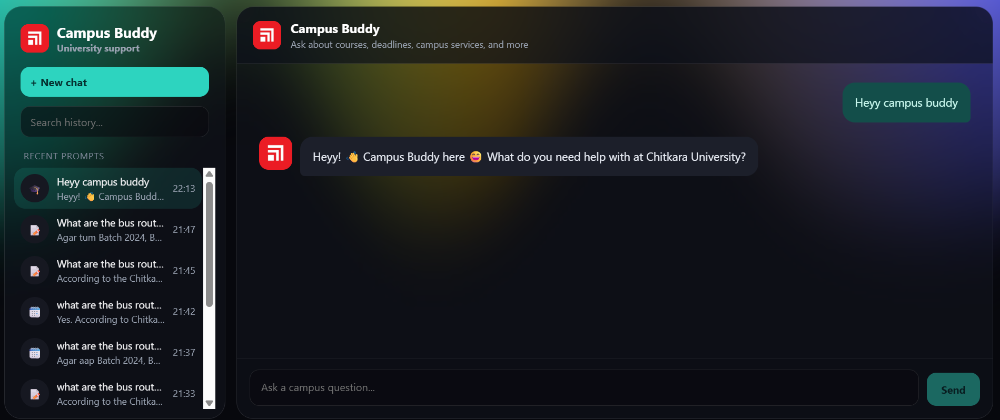
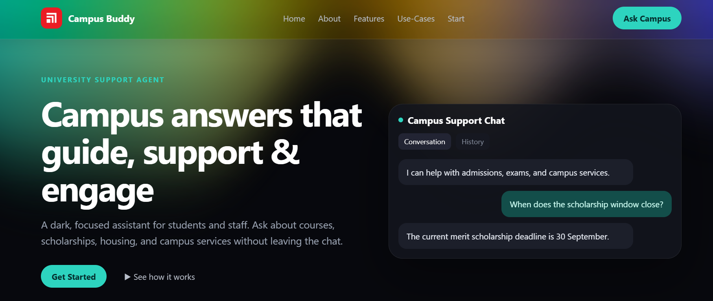
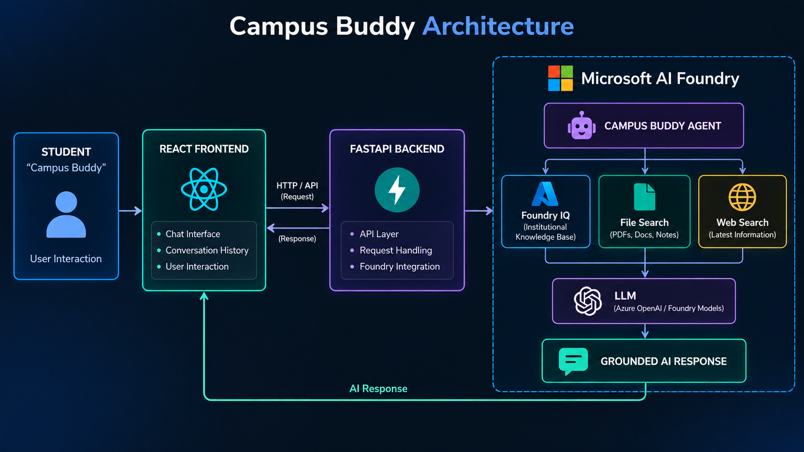

# 🎓 Campus Buddy — Chitkara University Support Agent

> **An AI-powered university support assistant that brings Chitkara University's academic, campus, and student-service information into one conversational interface.**

## 📌 Overview

**Campus Buddy** is an AI-powered university support agent built for Chitkara University. It allows students to ask questions in natural language and receive relevant, context-aware responses from university documents, institutional knowledge, the Chitkara website, and web sources.

Instead of searching through multiple PDFs, notices, webpages, and campus resources, students can simply ask Campus Buddy.

### Example Queries

- 🚌 "What are the bus routes and timings from Patiala to Chitkara University?"
- 🍔 "What food options are available at the campus outlets?"
- 📚 "What is the syllabus for Data Structures?"
- 🏠 "What are the hostel fees and rules?"
- 💰 "What is the fee structure for my course?"
- 📝 "What are the examination instructions?"
- 🗺️ "Where is a particular facility on campus?"

---

## 🖥️ Working Prototype

### Landing Page

The landing page introduces Campus Buddy and provides access to the university support assistant.



### Chatbot Interface

The chatbot provides a conversational interface with chat history, allowing users to ask university-related questions naturally.



---

## ✨ Key Features

- 💬 Conversational AI interface
- 📚 University document search
- 🧠 AI-powered knowledge retrieval
- 🔎 File Search
- 🌐 Web Search
- 🏫 Chitkara University website information
- 🧩 Foundry IQ integration
- 📖 Course and syllabus information
- 🚌 Bus routes and transportation information
- 🍔 Campus outlets and menu information
- 🏠 Hostel information
- 💰 Fee-related information
- 📝 Examination instructions and grading rules
- 🗺️ Campus infrastructure and map information
- 💭 Conversation history and context
- 🚀 AI agent deployment through Microsoft Azure AI Foundry

---

# 🏗️ System Architecture

The application follows a full-stack architecture consisting of a **React frontend**, **FastAPI backend**, and an AI layer built using **Microsoft Azure AI Foundry**.



### Architecture Flow

```text
Student
   ↓
React Frontend
   ↓
FastAPI Backend
   ↓
Microsoft Azure AI Foundry
   ↓
Campus Buddy Agent
   ↓
Foundry IQ / File Search / Web Search
   ↓
LLM
   ↓
Grounded AI Response
   ↓
React Chat Interface
```

---

# 🛠️ Technology Stack

### Frontend

- React.js
- HTML / CSS / JavaScript
- Conversational chat interface

### Backend

- FastAPI
- Python
- REST API
- Azure AI SDK

### AI & Cloud

- Microsoft Azure AI Foundry
- Azure AI Foundry Agent
- Foundry IQ
- LLM
- File Search
- Web Search

### Knowledge Sources

- Chitkara University documents
- Academic resources
- University notices and regulations
- Chitkara University website
- Web sources

---

# 🔄 How It Works

1. The user enters a question through the **React chatbot**.
2. React sends the request to the **FastAPI backend**.
3. FastAPI communicates with the **Campus Buddy agent** deployed on Microsoft Azure AI Foundry.
4. The agent identifies the relevant information source.
5. **Foundry IQ, File Search, Web Search, or university website information** is used to retrieve relevant context.
6. The retrieved context is provided to the **LLM**.
7. The LLM generates a context-aware response.
8. The response is returned through FastAPI and displayed in the React interface.

---

# 📚 Information Covered

### 🎓 Academics

- Course information
- Syllabus
- Academic regulations
- Grading rules
- Examination instructions
- Academic policies

### 🏫 Campus

- Campus infrastructure
- Campus map
- Facilities
- Departments
- University services

### 🚌 Transportation

- Bus routes
- Bus timings
- Transportation information

### 🍔 Campus Food

- Campus outlets
- Outlet information
- Menu items
- Food recommendations

### 🏠 Student Services

- Hostel information
- Hostel rules
- Hostel fees
- Fee information
- Scholarships
- Student facilities

---

# 🎯 Use Cases

| Use Case | Example |
|---|---|
| Academic Support | "What is the syllabus for DBMS?" |
| Examination | "What are the exam instructions?" |
| Transportation | "Which bus goes from Patiala to campus?" |
| Food | "Suggest something spicy from the campus outlets." |
| Hostel | "What are the hostel fees?" |
| Fees | "What is the fee structure?" |
| Campus Navigation | "Where is the library?" |
| University Information | "Tell me about the campus facilities." |

---

# 🚀 Future Scope

- 🎙️ Voice-enabled university assistant
- 🌐 Multilingual support
- 🔐 Student authentication and personalization
- 📅 Timetable and calendar integration
- 🔔 Smart notifications for deadlines and announcements
- 🎫 AI-powered helpdesk and ticket creation
- 📊 Student query analytics
- 📱 Mobile application
- 🔗 Integration with university ERP/LMS systems
- 🔄 Real-time synchronization of university information

---

# 🎯 Project Vision

> **Transform scattered university information into one intelligent, conversational platform that makes campus information faster and easier to access.**

---

## 📂 Project Structure

```text
campus-buddy/
│
├── frontend/
│   ├── src/
│   ├── public/
│   ├── package.json
│   └── ...
│
├── backend/
│   ├── main.py
│   ├── requirements.txt
│   └── ...
│
├── assets/
│   ├── landing-page.png
│   ├── chatbot-interface.png
│   └── architecture.png
│
├── README.md
└── .gitignore
```

---

## ⚙️ Getting Started

### Prerequisites

- Node.js
- Python 3.10+
- Microsoft Azure account
- Azure AI Foundry project
- Deployed Campus Buddy agent

### Frontend

```bash
cd frontend
npm install
npm run dev
```

### Backend

```bash
cd backend
pip install -r requirements.txt
uvicorn main:app --reload
```

---

## 🔐 Environment Variables

Create a `.env` file for your backend configuration:

```env
AZURE_AI_PROJECT_ENDPOINT=your_project_endpoint
AGENT_NAME=your_agent_name
AGENT_VERSION=your_agent_version
```

> **Never commit API keys, credentials, tokens, or other secrets to GitHub.**

---

## 🏆 Project Highlights

- Built specifically for **Chitkara University**
- AI-powered university information retrieval
- Multi-source knowledge retrieval
- Conversational question answering
- Microsoft Azure AI Foundry integration
- Foundry IQ integration
- University document and website search
- React + FastAPI full-stack architecture
- Deployed AI agent

---

## 👥 Project

**Campus Buddy — Chitkara University**

An AI-powered university support solution designed to make academic and campus information accessible through natural-language conversation.
